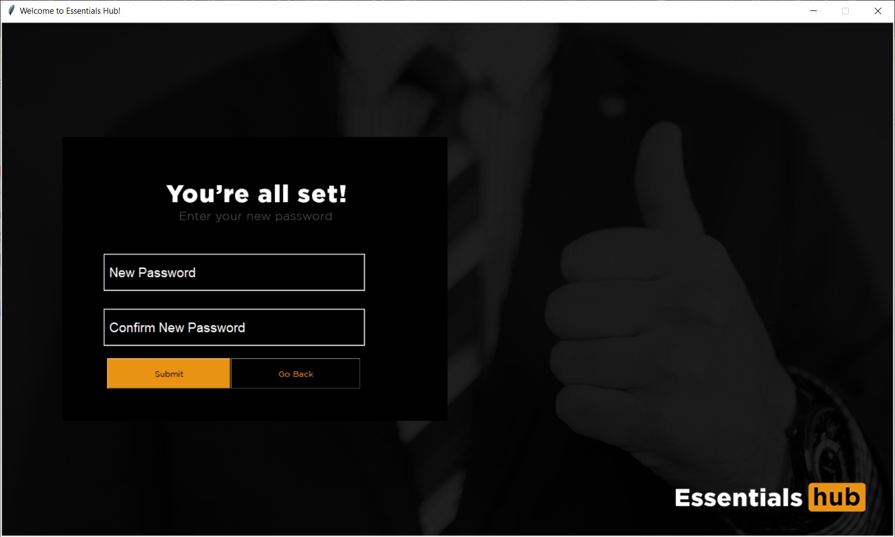
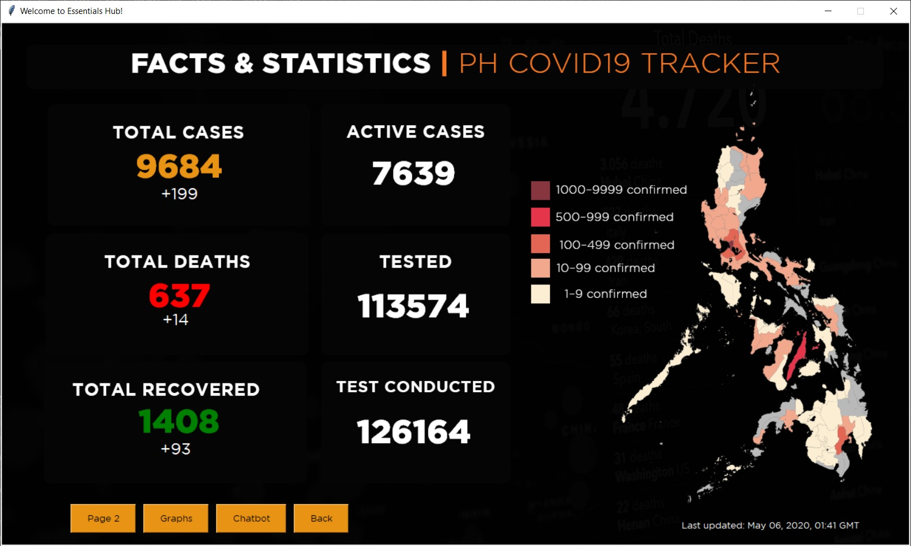
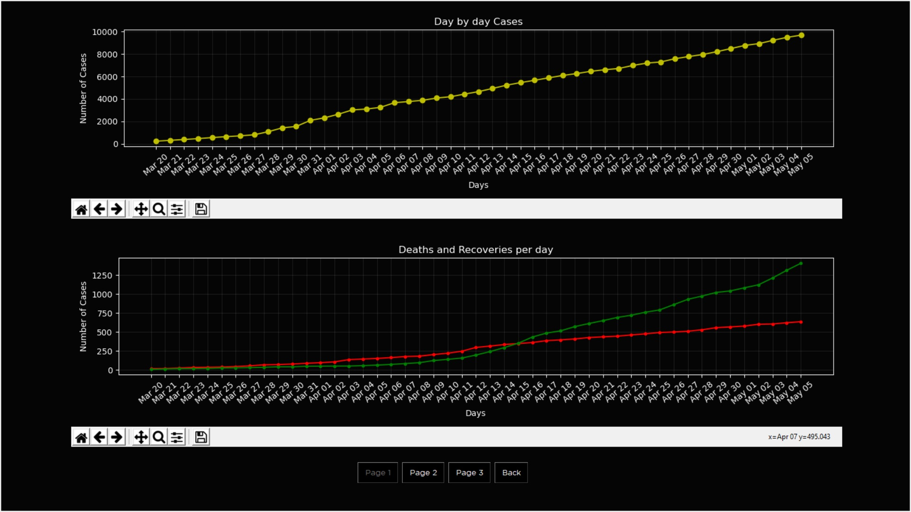
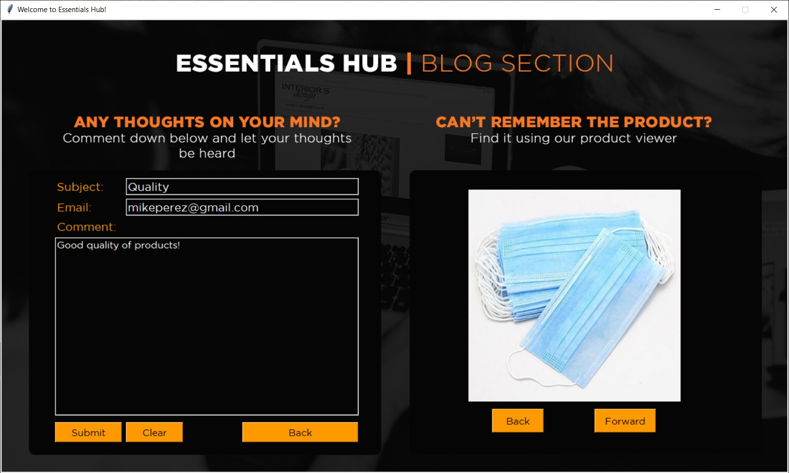
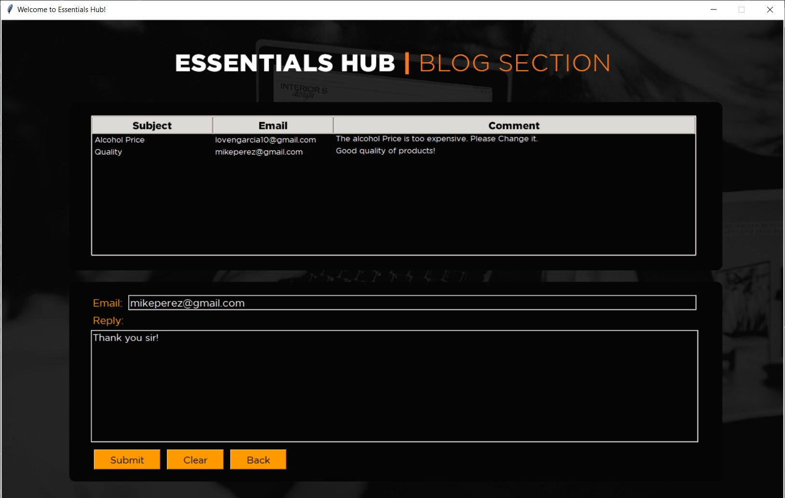
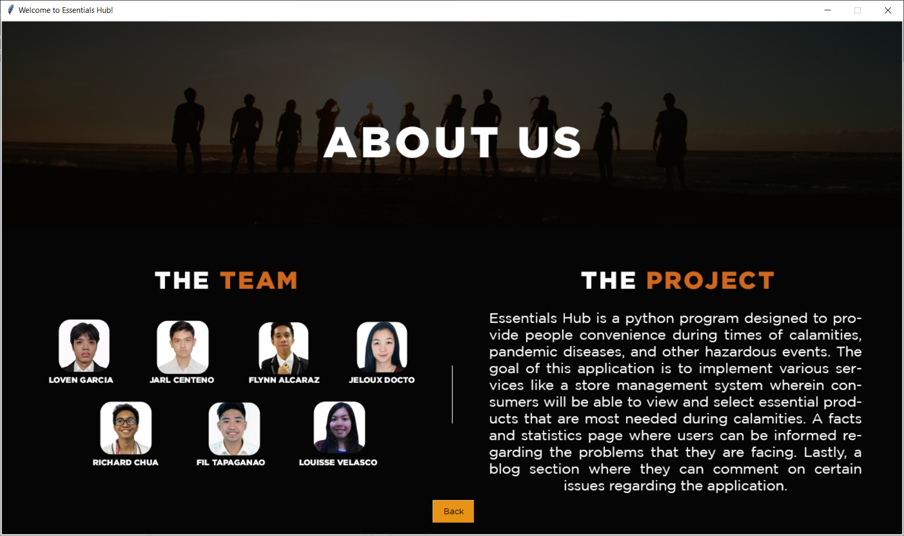

                       
                                                                     [](https://www.python.org/) 
##                                                    Team Members
```
                                               Loven Garcia
                                           Richard Vincent Chua
                                             Louisse Velasco
                                           Fil Janses Tapaganao
                                               Jeloux Docto
                                               Jarl Centeno
                                               Flynn Alcaraz
```
##                                                        Instructor
```
                                           Engr. Dionnis Padilla
```
<br><br>
## Project Documentation
* [Overview](#overview)
* [Project Features](##Project-Features)
* [Setup and Intallation](#setup-and-installation)
  * [Requirements](#requirements)
* [Introduction](#introduction)
* [Objectives](#objectives)
* [User Stories](#user-stories)
  * [List of all User Stories](#List-of-all-User-Stories)
* [Sample SnapGrabs](#sample-screengrabs)
  * [Launcher](#launcher)
  * [Sign-in Form](#Sign-in-Form)
  * [Sign-up Form](#Sign-up-Form)
  * [Forgot Password Feature](#Forgot-Password-Feature)
  * [Main Page for Guests](#Main-Page-for-Guests)
  * [Inventory Management System](#Inventory-Management-System)
  * [Statistics Page](#Statistics-Page)
  * [Graphs/Visualization](#Graphs/Visualization)
  * [Chatbot](#chatbot)
  * [Blog Section for Guests](#Blog-Section-for-Guests)
  * [Main Page for Admins](#Main-Page-for-Admins)
  * [Blog Section for Admin](#Blog-Section-for-Admin)
  * [About Us](#About-Us)

<br>
<div style='text-align: justify;'>


## Overview

Essentials Hub is a python program designed to provide people convenience during times of calamities, pandemic diseases, and other hazardous events. The goal of this application is to implement various services like a store management system wherein consumers will be able to view and select essential products that are most needed during calamities. A facts and statistics page where users can be informed regarding the problems that they are facing. Lastly, a blog section where they can comment on certain issues regarding the application. 


## Project Features
1. Sign Up page - Enables admin or guest to create an account by signing up information.
2. Forgot Password - A recovery page to reset forgotten password. 
3. Product Inventory System (admin and guest) - Allows guest to view information about the available items & Allows admin to monitor and manage the item supplies.
4. Facts and statistics - Provides facts, information and daily updates about the Novel Coronavirus.
5. Visualization of graphs - Provides visual information for faster comprehension of the data. 
6. Chatbot - An artificial intelligence that answers random and frequently asked questions about the Novel Coronavirus.
7. Blog Section - It allows user such as guests and admins to post and discuss a about certain topic, either posting new information or asking questions.
  
  
  
## Setup and Installation

To be able to run the application, you need to have a new environment with Python 3.6 on it. 
If you have anaconda installed, open the terminal and execute the code below
```
conda create -n E-Hub_env python=3.6
```

Once you have created a new envriment, just activate it
```
conda activate E-Hub_env
```

### Requirements

<ul><li> <b>pillow</b></li>
<li> <b>secure-smtplib</b></li>
<li> <b>bs4</b></li>
<li> <b>requests</b></li>
<li> <b>pandas</b></li>
<li> <b>pandastable</b></li>
<li> <b>matplotlib</b></li>
<li> <b>tensorflow version1.14.0</b></li>
<li> <b>nltk</b></li>
<li> <b>tflearn</b></li>
<li> <b>numpy</b></li>
<li> <b>Gotham Family Font (https://freefontsfamily.com/gotham-font-family/)</b></li></ul>

Examples
```
pip install pandas
```
```
pip install tensorflow==1.14.0
```

## Introduction
  In the midst of pandemic, it is very dangerous to roam around outside. However, this cannot be prevented since most people go outside to buy necessary items and at times like this people also want to gain information about the current situation of the problem that the humanity is facing today. 

  Therefore, we have come up with an idea to create an application where the people doesn’t need to step outside their house in order to buy the essentials.

  Essentials Hub is an application that allows the user to meet their needs in terms of crisis like this. This application can also be reliable in terms of viewing helpful information that allows the user to view statistics and graphs that are useful for them to be aware about the present circumstances. This does not only help the people to become aware of the current situation, but also helping them prevent the spread of the virus by making them stay at home without having to think about how they are going to buy their needs.


## Objectives

The objectives of the project are the following:
- To create an online shopping program specified for calamities.
- To collect info regarding COVID-19 cases and their localities in the Philippines.
- To visualize the gathered information into appropriate graphs.
- To create an Artificial Intelligence for convenience in terms of query.
- To develop a blog section for a direct communication between the client and administrator.


## User Stories

### List of all User Stories

- **User stories (Customers)**
  + **Sign-up form**
    + As a customer, I want to be able to create my personal account.
  + **Forgot password feature**
    + As a customer, I want to be able to change my password in case I forgot it.
  + **Sign-in form**
    + As a customer, I want to be able to log-in to the application for me to use the services offered by the program.
   
  + **Online Shop main GUI**
    + As a customer, I want to be able to shop online using the app, I want to see different features like add to cart, view my cart, view all products, search for items, and view or add ratings to products.
  + **View all Products**
    + As a customer, I want to be able to view all the essential products that are available to the store.
  + **Search for products (By name)**
    + As a customer, I want to be able to search for the product that I want through its name.
  + **View my cart**
    + As a customer, I want to be able to view my cart along with the its details (ID, name, price, quantity)
  + **Save Receipt**
    + As a customer, I want to be able to save my receipt to a text file.
  + **Facts and Statistics main GUI**
    + As a customer, I want to be able to view substantial statistics that are helpful in understanding the details of a certain calamity or pandemic diseases. I also want to see a button for the visualization and for the chatbot.
  + **Graphs Visualization**
    + As a customer, I want to be able to see useful graphs that are understadable and can explain the vital statistics about certain events/pandemic.
  + **Chatbot**
    + As a user, I want to be able to interact with a bot regarding the happenings during COVID19.
    
  + **Give comments/suggestions**
    + As a customer, I want to be able to send comments or sugestions regarding anything with the program. 
  + **Products Viewer**
    + As a customer, I want to be able to view the products alongside the comment box for me to easily remember the details for my comment/suggestions.
   
  + **About Us**
    + As a user, I want to be able to see the programmers involved in this application.
    
    
- **User stories (Administrator)**
  + **View all products**
    + As an admin, I want to be able to view all the remaining products in the database
  + **Add/Update/delete products**
    + As an admin, I wanto to be able to add/update/delete products to the database.

  + **View comments**
    + As an admin, I want to be able to view all the comments/suggestions of the customers
  + **Reply to comments**
    + As an admin, I want to be able to send  replies to the comments of the customers through their emails.
    
    
## Sample ScreenGrabs

### Launcher


### Sign-in Form


### Sign-up Form


### Forgot Password Feature




### Main Page for Guests


### Inventory Management System


### Statistics Page



### Graphs/Visualization



### Chatbot 


### Blog Section for Guests


### Main Page for Admins


### Inventory Management for Admins


### Blog Section for Admin


### About Us



